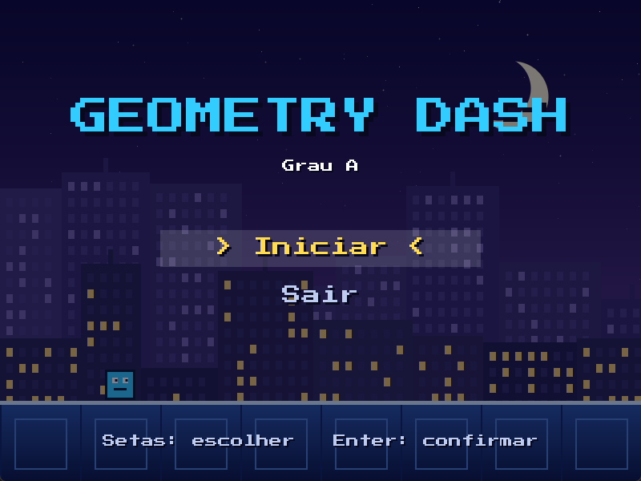
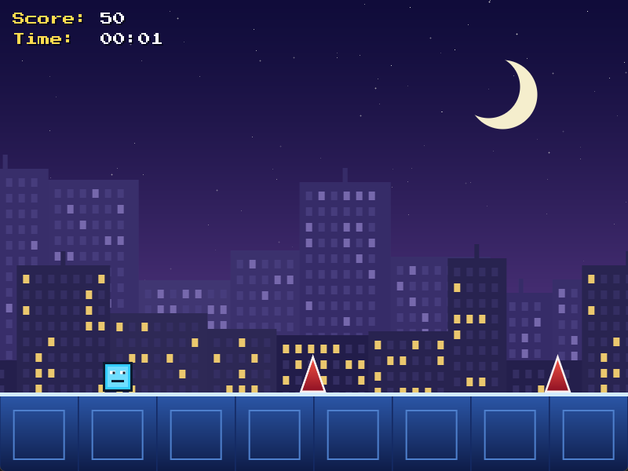
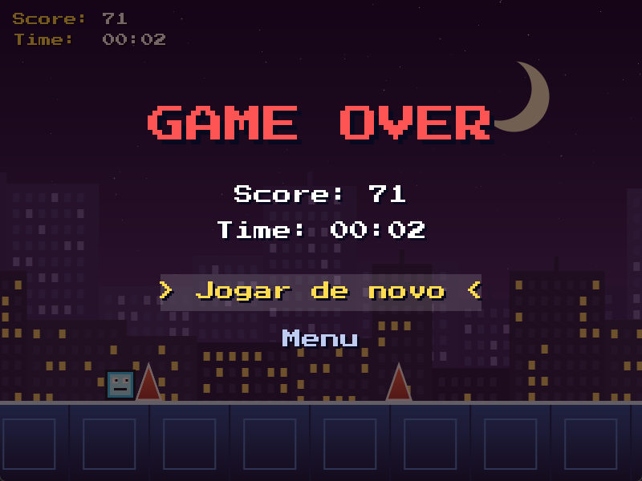

# Geometry Dash simplificado

**Autores:** Gabriel Gomes e Guilherme Paes

**Disciplina:** Processamento Gráfico I, semestre 2026/2

**Professora:** Rossana Queiroz

---

Trabalho do Grau A: um jogo 2D no estilo *runner*, inspirado em Geometry Dash,
feito em C++ com OpenGL 3.3. Um cubo corre sozinho por uma cidade à noite e o
jogador precisa pular os espinhos. Quanto mais longe, maior a pontuação.

| Menu inicial | Partida | Game over |
|:---:|:---:|:---:|
|  |  |  |

## Sumário

- [Sobre o projeto](#sobre-o-projeto)
- [Estrutura do projeto](#estrutura-do-projeto)
- [Como compilar](#como-compilar)
- [Como executar e jogar](#como-executar-e-jogar)
- [Uso de IA nos assets](#uso-de-ia-nos-assets)
- [Créditos e licenças](#créditos-e-licenças)

## Sobre o projeto

O jogo tem três telas: o menu inicial, a partida e a tela de game over.
Durante a partida, o placar no canto superior esquerdo mostra a pontuação
(distância percorrida) e o tempo vivo.

### O que o jogo demonstra

| Conceito | Como aparece no jogo |
|---|---|
| OpenGL 3.3 com shaders | Contexto 3.3 *core profile*, com um vertex shader e um fragment shader em GLSL 3.30 |
| Buffers de geometria | Um único quad (VAO, VBO e EBO) reaproveitado para desenhar tudo: sprites, fundos e letras |
| Matriz de projeção | Projeção ortográfica de 800x600. A câmera 2D é o deslocamento dos limites da projeção; a HUD usa uma segunda projeção, sem câmera, e por isso fica parada na tela |
| Matriz de modelo | Translação, rotação e escala de cada objeto, recalculadas a cada frame. O cubo dá uma volta completa durante o pulo |
| Sprites e spritesheets | O personagem tem 8 quadros e 2 animações (correndo e pulando); o espinho tem 4 quadros. O quadro é escolhido no shader, deslocando as coordenadas de textura |
| Fundo em camadas com parallax | Três camadas (céu, prédios distantes e prédios próximos), cada uma rolando em uma velocidade |
| Controle do personagem | Pulo com a barra de espaço, com gravidade e tempo por frame (*delta time*) |
| Colisão por hitbox | Teste AABB entre o cubo e os espinhos. O mesmo teste decide em qual opção do menu o mouse está |
| HUD com texto | Menu, placar e game over desenhados com uma fonte `.ttf` convertida em textura |
| Áudio | Música em loop durante a partida e quatro efeitos sonoros |

### Tecnologias

| Biblioteca | Para que serve |
|---|---|
| [GLFW](https://www.glfw.org/) | Janela, contexto OpenGL, teclado e mouse |
| [GLAD](https://glad.dav1d.de/) | Carrega as funções da OpenGL |
| [GLM](https://github.com/g-truc/glm) | Vetores e matrizes |
| [stb_image](https://github.com/nothings/stb) | Leitura dos arquivos de imagem |
| [stb_truetype](https://github.com/nothings/stb) | Leitura da fonte `.ttf` |
| [miniaudio](https://miniaud.io/) | Música e efeitos sonoros |

## Estrutura do projeto

```
PG2026-2-Trabalho-GA/
├── README.md                  este arquivo
├── docs/                      capturas de tela usadas neste README
├── build/                     gerada pelo CMake (objetos, executável e dependências)
└── PG2026-2-main/             projeto CMake
    ├── CMakeLists.txt
    ├── Common/glad.c          implementação da GLAD
    ├── include/glad/          cabeçalhos da GLAD
    ├── src/Geometry-Dash/     código do jogo
    ├── assets/                imagens, fonte, música e efeitos sonoros
    │   ├── fonts/
    │   └── sfx/
    └── misc/                  scripts que geram as imagens e os efeitos sonoros
```

### Código (`PG2026-2-main/src/Geometry-Dash/`)

| Arquivo | O que faz |
|---|---|
| `main.cpp` | Cria a janela, carrega os assets e roda o *game loop* (entrada, atualização, desenho) |
| `Config.h` | Constantes compartilhadas: tamanho do mundo e da janela, altura do chão |
| `Sprite.h` | A struct `Sprite`: posição, tamanho, rotação, textura, quadro de animação e hitbox |
| `Shader.h/.cpp` | Compila e linka os shaders e envia os *uniforms* |
| `Texture.h/.cpp` | Carrega imagens e cria as texturas na GPU |
| `Font.h/.cpp` | Converte a fonte `.ttf` em uma textura com todos os caracteres |
| `Renderer.h/.cpp` | Todo o desenho: quad, projeção, matriz de modelo, sprites, parallax e textos |
| `Game.h/.cpp` | Estado e regras do jogo: telas, pulo, obstáculos, colisão, animações, pontuação e tempo |
| `Hud.h/.cpp` | Desenha o placar, o menu inicial e a tela de game over |
| `Audio.h/.cpp` | Toca a música e os efeitos sonoros |

A lógica (`Game`) e o desenho (`Renderer`) não se conhecem. O `Game` só altera
os dados dos sprites, e o `Renderer` só lê esses dados para desenhar. O
`main.cpp` liga os dois a cada frame:

```cpp
game.processInput(window);          // teclado e mouse
game.update(dt);                    // física, colisões, animações e câmera

renderer.beginFrame(game.cameraX);  // projeção com câmera
// camadas de fundo, chão, obstáculos e personagem, do fundo para a frente
renderer.beginHUD();                // projeção sem câmera
drawHud(renderer, fonts, game);     // placar e menus, por cima de tudo
```

### Assets (`PG2026-2-main/assets/`)

| Arquivo | Uso | Formato |
|---|---|---|
| `player.png` | Personagem | Spritesheet de 8 colunas x 2 linhas, quadro de 80x80 |
| `spike.png` | Obstáculo | Spritesheet de 4 colunas x 1 linha, quadro de 72x100 |
| `ground.png` | Chão | Bloco de 100x100, repetido lado a lado |
| `bg_sky.png` | Fundo, camada 1 | Céu, parado na tela |
| `bg_far.png` | Fundo, camada 2 | Prédios distantes, rolam a 25% da velocidade do mundo |
| `bg_near.png` | Fundo, camada 3 | Prédios próximos, rolam a 50% da velocidade do mundo |
| `fonts/PressStart2P-Regular.ttf` | Textos | Fonte TrueType |
| `Arcade_Rush.mp3` | Música da partida | MP3 |
| `sfx/select.wav` | Trocar de opção no menu | WAV mono, 16 bits |
| `sfx/confirm.wav` | Confirmar a opção | WAV mono, 16 bits |
| `sfx/jump.wav` | Pular | WAV mono, 16 bits |
| `sfx/death.wav` | Morrer | WAV mono, 16 bits |

## Como compilar

### Pré-requisitos

- [CMake](https://cmake.org/) 3.11 ou mais novo
- Um compilador com suporte a C++17 (o projeto foi desenvolvido com o g++ do MSYS2/MinGW, no Windows)
- Git
- Internet na primeira compilação: o CMake baixa a GLFW, a GLM, a stb e a miniaudio

### Pelo terminal

A partir da raiz do repositório:

```bash
cmake -S PG2026-2-main -B build -G "MinGW Makefiles"
cmake --build build
```

O executável é criado em `build/Geometry-Dash.exe`.

### Pelo VS Code

Com a extensão **CMake Tools**, abra a raiz do repositório. O arquivo
`.vscode/settings.json` já aponta para a pasta `PG2026-2-main`, então basta
configurar e compilar pela barra da extensão.

> **Outros sistemas.** O `CMakeLists.txt` tem as configurações para Linux e
> macOS (sem o `-G "MinGW Makefiles"`), mas o projeto só foi compilado e
> testado no Windows.

## Como executar e jogar

Depois de compilar, a partir da raiz do repositório:

```bash
build/Geometry-Dash.exe
```

O jogo encontra a pasta `assets/` pelo caminho absoluto gravado na compilação,
então pode ser executado de qualquer pasta. Se o repositório for movido de
lugar, compile de novo.

### Controles

| Onde | Tecla | Ação |
|---|---|---|
| Menus | Setas ou `W` / `S` | Escolher a opção |
| Menus | `Enter` ou `Espaço` | Confirmar |
| Menus | Mouse | Passar por cima escolhe, clicar confirma |
| Partida | `Espaço` | Pular |
| Qualquer tela | `Esc` | Fechar o jogo |

### Como funciona uma partida

1. O jogo abre no menu, com as opções **Iniciar** e **Sair**.
2. Ao iniciar, o cubo começa a correr e a música começa a tocar.
3. O placar mostra o **Score** (distância percorrida) e o **Time** (tempo
   vivo, em minutos e segundos).
4. Encostar em um espinho encerra a partida: a música para e aparece a tela
   de game over, com a pontuação final e as opções **Jogar de novo** e **Menu**.

## Uso de IA nos assets

As imagens, os efeitos sonoros e a música do jogo foram gerados com ajuda de
inteligência artificial. A fonte dos textos não: ela é uma fonte livre feita
por pessoas (ver [Créditos e licenças](#créditos-e-licenças)).

| Asset | Ferramenta | Como foi gerado |
|---|---|---|
| Imagens (personagem, espinho, chão e os três fundos) | Claude, da Anthropic | A IA escreveu um script que desenha as imagens |
| Efeitos sonoros (os quatro `.wav`) | Claude, da Anthropic | A IA escreveu um script que sintetiza os sons |
| Música (`Arcade_Rush.mp3`) | Ferramenta de IA de geração de música | Gerada pela dupla e adicionada ao projeto |

### Imagens

As imagens não vieram de um gerador de imagens. Pedimos ao Claude os sprites
e os fundos, e ele escreveu um script em Python,
[`gerar_assets.py`](PG2026-2-main/misc/gerar_assets.py), que desenha cada
imagem pixel a pixel e grava o arquivo PNG:

- **Personagem:** um cubo com rosto, montado com retângulos. Os 8 quadros
  variam o brilho do miolo e fazem o cubo piscar; a segunda linha da
  spritesheet tem a expressão do pulo.
- **Espinho:** um triângulo com contorno e degradê, com as bordas suavizadas
  por superamostragem. Os 4 quadros fazem a cor pulsar.
- **Chão:** um bloco com degradê e moldura, feito para emendar com o vizinho.
- **Fundos:** um céu em degradê com estrelas e lua, e duas fileiras de prédios
  com janelas acesas, sorteadas com semente fixa.

O script usa só a biblioteca padrão do Python e gera sempre as mesmas imagens,
então qualquer pessoa pode reproduzi-las ou mudar cores e formas.

### Efeitos sonoros

Os efeitos seguem a mesma ideia. O Claude escreveu o script
[`gerar_sfx.py`](PG2026-2-main/misc/gerar_sfx.py), que sintetiza os quatro
sons no estilo dos videogames de 8 bits e grava os arquivos WAV:

| Som | Como é feito |
|---|---|
| Trocar de opção | Um toque curto de onda quadrada |
| Confirmar | Duas notas em sequência, a segunda mais aguda |
| Pular | Onda quadrada com a frequência subindo |
| Morrer | Onda quadrada com a frequência descendo, misturada com ruído |

A IA não ouve o resultado: ela garantiu que os arquivos eram válidos e tocavam
no momento certo, e avaliar como soam ficou por nossa conta, jogando.

### Música

A música da partida, `Arcade_Rush.mp3`, foi gerada por nós com uma ferramenta
de IA de geração de música e adicionada à pasta de assets.

### Como reproduzir

Os arquivos gerados já estão no repositório, então não é preciso rodar nada
para compilar ou jogar. Para gerar de novo as imagens e os efeitos sonoros, a
partir da pasta `PG2026-2-main`:

```bash
python misc/gerar_assets.py
python misc/gerar_sfx.py
```

## Créditos e licenças

- **Fonte:** [Press Start 2P](https://fonts.google.com/specimen/Press+Start+2P),
  de CodeMan38, sob a SIL Open Font License 1.1. O texto da licença está em
  [`PG2026-2-main/assets/fonts/OFL.txt`](PG2026-2-main/assets/fonts/OFL.txt).
- **Bibliotecas:** GLFW, GLAD, GLM, stb e miniaudio, cada uma sob a sua
  própria licença.
- **Jogo original:** Geometry Dash é uma criação da RobTop Games. Este projeto
  é um trabalho acadêmico, sem fins comerciais.
